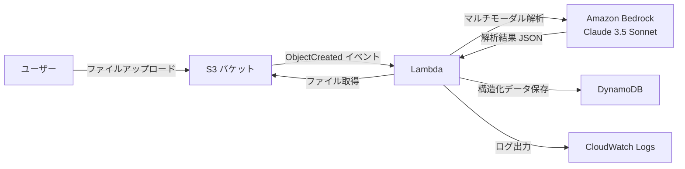

# aws-multimodal-analysis

画像・PDF などの業務文書を S3 にアップロードするだけで自動解析し、
構造化データとして DynamoDB に保存する PoC です。

---

## 想定する社内業務

| 文書種別 | 現状の課題 | このシステムでの改善 |
|---------|-----------|-------------------|
| 請求書 | 手入力でシステムに登録（時間・ミスのリスク） | アップロードで自動抽出・登録 |
| 見積書 | PDF を目視確認して金額を転記 | 金額・品目を自動構造化 |
| 作業報告書 | 紙やスキャン PDF を手動でデータ化 | 自動テキスト抽出 |
| 申込書 | 氏名・住所などを手動で入力 | フォームデータを自動抽出 |

## 想定利用者

- 経理・総務担当者（請求書・見積書処理）
- 現場スタッフ（作業報告書のデジタル化）
- システム管理者（PoC の評価・改善担当）

---

## AWS 構成図



---

## ビジネス価値

- **データ入力工数の削減**: 手入力ゼロで構造化データを生成
- **ミスの排除**: 人的な転記ミスをなくす
- **処理速度の向上**: アップロードから数秒で解析完了
- **スケーラビリティ**: 大量の文書を並列処理可能

## PoC の成功指標

| 指標 | 目標値 | 計測方法 |
|-----|-------|---------|
| 抽出成功率 | 80% 以上 | DynamoDB の status=success 件数 / 全件数 |
| 処理時間 | 30 秒以内 | CloudWatch Lambda Duration |
| フィールド抽出精度 | 主要フィールド 90% 以上 | サンプル文書で人手検証 |

---

## 処理フロー

```
S3 にファイルをアップロード
  │ ObjectCreated イベント
  ▼
Lambda が起動
  ├─① ファイル検証（拡張子・サイズ）
  ├─② S3 からファイル取得
  ├─③ Bedrock（Claude）でマルチモーダル解析
  │       ファイル名から文書種別を判定 → プロンプト切り替え
  └─④ 解析結果を DynamoDB に保存
```

---

## セットアップ手順

### 1. Bedrock モデルのアクセス許可

AWS コンソール → Amazon Bedrock → モデルアクセス → **Claude 3.5 Sonnet を有効化**

### 2. Terraform でデプロイ

```bash
cd terraform
cp terraform.tfvars.example terraform.tfvars
# s3_bucket_suffix に AWS アカウント ID などを設定

terraform init
terraform plan
terraform apply
```

### 3. 動作確認

```bash
# PDF をアップロード
aws s3 cp invoice.pdf s3://<バケット名>/uploads/invoice.pdf

# Lambda のログを確認
aws logs tail /aws/lambda/multimodal-dev --follow

# DynamoDB に結果が保存されたか確認
aws dynamodb scan --table-name multimodal-dev-results
```

---

## セキュリティ上の注意点

| 項目 | 対応状況 |
|-----|---------|
| S3 パブリックアクセス | 全ブロック済み |
| S3 暗号化 | AES-256 サーバーサイド暗号化 |
| IAM 最小権限 | S3 読み取り・Bedrock・DynamoDB のみ |
| 機密情報のログ出力 | ファイル内容はログに出力しない |

---

## 推定コスト（月額）

| リソース | 単価 | 月間想定 | 小計 |
|---------|------|---------|------|
| Lambda | $0.0000002/リクエスト | 500回 | ~$0.01 |
| Bedrock Claude 3.5 Sonnet | $3/1M input tokens | 500回×1000tokens | ~$1.50 |
| S3 | $0.025/GB | 1GB | ~$0.03 |
| DynamoDB | PAY_PER_REQUEST | 500件 | ~$0.01 |
| **合計** | | | **~$1.55/月** |

> ⚠️ Bedrock の画像解析はテキストより高コスト。大量処理時は Haiku に切り替えを検討。

---

## 今後の拡張ポイント

| 拡張項目 | 内容 |
|---------|------|
| PDF 対応強化 | pymupdf でページ画像に変換して処理 |
| 文書種別の自動判定 | ファイル名以外にも内容から判定 |
| 検証ワークフロー | 抽出結果を人間がレビューする画面 |
| 業務システム連携 | DynamoDB → 会計システムへの自動登録 |
| エラー通知 | 解析失敗時に SNS でメール通知 |

---

## 後片付け

```bash
# S3 バケットを空にしてから destroy
aws s3 rm s3://<バケット名> --recursive
terraform destroy
```

> ⚠️ S3 バケットにファイルが残っていると destroy が失敗します。先に空にしてください。

---

*このプロジェクトは学習・PoC 目的で作成しました。本番導入時は抽出精度の検証・エラー通知・監査ログの追加が必要です。*
