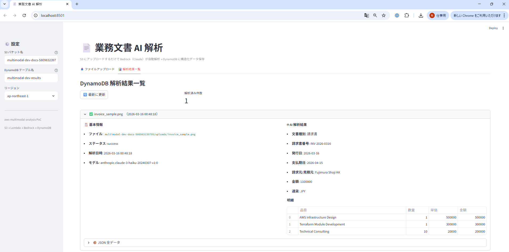
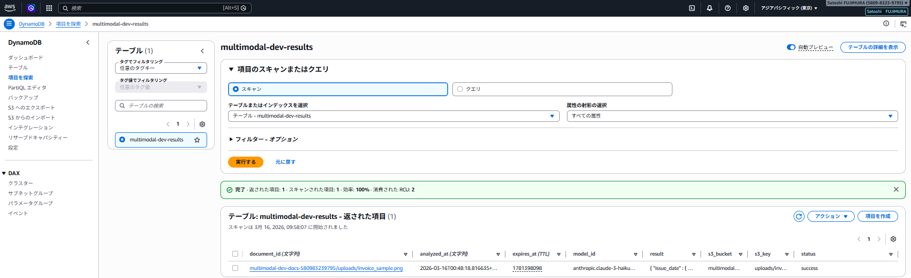
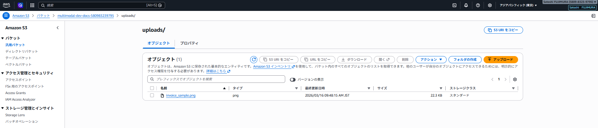
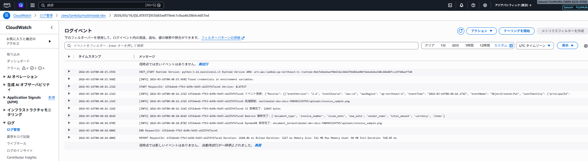

# aws-multimodal-analysis


画像・PDF などの業務文書を S3 にアップロードするだけで自動解析し、
構造化データとして DynamoDB に保存する PoC です。

## 動作画面

| Streamlit Web UI（解析結果一覧） | DynamoDB（解析結果保存） |
|---|---|
|  |  |

| S3（アップロード済みファイル） | CloudWatch Logs（Lambda 実行ログ） |
|---|---|
|  |  |

---

## 想定する社内業務

| 文書種別 | 現状の課題 | このシステムでの改善 |
|---------|-----------|-------------------|
| 請求書 | 手入力でシステムに登録（時間・ミスのリスク） | アップロードで自動抽出・登録 |
| 見積書 | PDF を目視確認して金額を転記 | 金額・品目を自動構造化 |
| 作業報告書 | 紙やスキャン PDF を手動でデータ化 | 自動テキスト抽出 |
| 申込書 | 氏名・住所などを手動で入力 | フォームデータを自動抽出 |

## 想定利用者

- 経理・総務担当者（請求書・見積書処理）
- 現場スタッフ（作業報告書のデジタル化）
- システム管理者（PoC の評価・改善担当）

---

## AWS 構成図


---

## ビジネス価値

- **データ入力工数の削減**: 手入力ゼロで構造化データを生成
- **ミスの排除**: 人的な転記ミスをなくす
- **処理速度の向上**: アップロードから数秒で解析完了
- **スケーラビリティ**: 大量の文書を並列処理可能

## PoC の成功指標

| 指標 | 目標値 | 計測方法 |
|-----|-------|---------|
| 抽出成功率 | 80% 以上 | DynamoDB の status=success 件数 / 全件数 |
| 処理時間 | 30 秒以内 | CloudWatch Lambda Duration |
| フィールド抽出精度 | 主要フィールド 90% 以上 | サンプル文書で人手検証 |

---

## 処理フロー

```
S3 にファイルをアップロード
  │ ObjectCreated イベント
  ▼
Lambda が起動
  ├─① ファイル検証（拡張子・サイズ）
  ├─② S3 からファイル取得
  ├─③ Bedrock（Claude）でマルチモーダル解析
  │       ファイル名から文書種別を判定 → プロンプト切り替え
  └─④ 解析結果を DynamoDB に保存
```

---

## セットアップ手順

### 1. Bedrock モデルのアクセス許可

AWS コンソール → Amazon Bedrock → モデルアクセス → **Claude 3 Haiku を有効化**

> **Note:** Claude 3.5 Sonnet v2 はオンデマンド直接呼び出し非対応（inference profile が必要）のため、本 PoC では Claude 3 Haiku を使用しています。

### 2. Terraform でデプロイ

```bash
cd terraform
cp terraform.tfvars.example terraform.tfvars
# s3_bucket_suffix に AWS アカウント ID などを設定

terraform init
terraform plan
terraform apply
```

### 3. 動作確認

```bash
# PDF をアップロード
aws s3 cp invoice.pdf s3://<バケット名>/uploads/invoice.pdf

# Lambda のログを確認
aws logs tail /aws/lambda/multimodal-dev --follow

# DynamoDB に結果が保存されたか確認
aws dynamodb scan --table-name multimodal-dev-results
```

---

## セキュリティ上の注意点

| 項目 | 対応状況 |
|-----|---------|
| S3 パブリックアクセス | 全ブロック済み |
| S3 暗号化 | AES-256 サーバーサイド暗号化 |
| IAM 最小権限 | S3 読み取り・Bedrock・DynamoDB のみ |
| 機密情報のログ出力 | ファイル内容はログに出力しない |

---

## 推定コスト（月額）

| リソース | 単価 | 月間想定 | 小計 |
|---------|------|---------|------|
| Lambda | $0.0000002/リクエスト | 500回 | ~$0.01 |
| Bedrock Claude 3 Haiku | $0.25/1M input tokens | 500回×1000tokens | ~$0.13 |
| S3 | $0.025/GB | 1GB | ~$0.03 |
| DynamoDB | PAY_PER_REQUEST | 500件 | ~$0.01 |
| **合計** | | | **~$1.55/月** |

> ⚠️ Bedrock の画像解析はテキストより高コスト。大量処理時は Haiku に切り替えを検討。

---

## 今後の拡張ポイント

| 拡張項目 | 内容 |
|---------|------|
| PDF 対応強化 | pymupdf でページ画像に変換して処理 |
| 文書種別の自動判定 | ファイル名以外にも内容から判定 |
| 検証ワークフロー | 抽出結果を人間がレビューする画面 |
| 業務システム連携 | DynamoDB → 会計システムへの自動登録 |
| エラー通知 | 解析失敗時に SNS でメール通知 |

---

## 後片付け

```bash
# S3 バケットを空にしてから destroy
aws s3 rm s3://<バケット名> --recursive
terraform destroy
```

> ⚠️ S3 バケットにファイルが残っていると destroy が失敗します。先に空にしてください。

---

*このプロジェクトは学習・PoC 目的で作成しました。本番導入時は抽出精度の検証・エラー通知・監査ログの追加が必要です。*

---

## CI / セキュリティスキャン

GitHub Actions で Python ユニットテスト・Terraform 静的解析（Checkov）を自動実行しています。

### 実施内容

| ジョブ | 内容 |
|---|---|
| terraform fmt / validate | フォーマット・構文チェック |
| Python ユニットテスト | pytest で Lambda 関数のロジックを検証 |
| Checkov セキュリティスキャン | IaC のセキュリティポリシー違反を検出（soft_fail: false） |

### セキュリティ対応（Terraform で修正した内容）

| リソース | 追加設定 |
|---|---|
| S3 | SSE-AES256 暗号化・パブリックアクセスブロック（4項目）・バージョニング |
| Lambda | `tracing_config { mode = "PassThrough" }`（X-Ray 有効化） |
| DynamoDB | PITR（Point-in-Time Recovery）・`deletion_protection_enabled = true` |
| IAM（Bedrock ポリシー） | 特定モデル ARN に限定（ワイルドカード使用なし） |

### 意図的にスキップしている項目（PoC の合理的な省略）

| チェック ID | 内容 | 理由 |
|---|---|---|
| CKV_AWS_117 | Lambda VPC 内配置 | PoC では不要 |
| CKV_AWS_116 | Lambda DLQ 設定 | PoC では不要 |
| CKV_AWS_115 | Lambda 予約済み同時実行 | PoC では不要 |
| CKV_AWS_158 | CloudWatch Logs KMS | AWS 管理キーで十分 |
| CKV_AWS_338 | CloudWatch Logs 保持期間 | dev は 30 日で十分 |
| CKV_AWS_145 | S3 KMS 暗号化 | AES256 で十分 |
| CKV_AWS_18 / CKV_AWS_144 | S3 アクセスログ・レプリケーション | PoC では不要 |

---

## 学習で気づいたこと・躓いたポイント

### Bedrock / Lambda

- **Bedrock のマルチモーダル API はファイルサイズに注意**: 大きな PDF をそのままバイナリで渡すと `ValidationException` になる。Claude 3 Haiku は画像・PDF を base64 エンコードして渡す仕様のため、ファイルサイズ上限（5MB / ページ数）を事前に確認する。
- **ファイル種別の判定はファイル名より MIME タイプが確実**: 拡張子が `.pdf` でも中身が壊れている場合がある。Lambda 内で拡張子ベースで判定しつつ、Bedrock へのリクエスト前にファイルの先頭バイトで MIME タイプを検証するとより堅牢。
- **Bedrock のレスポンス解析は `content[0]["text"]` を参照**: `invoke_model()` のレスポンスは `response["body"].read()` で読み取り、`json.loads()` 後に `result["content"][0]["text"]` を取得する。階層が深いため最初は混乱しやすい。

### Terraform / S3

- **S3 バージョニング有効バケットの `terraform destroy` が失敗**: バージョニングを有効にすると削除マーカーが残り destroy が途中で失敗する。バージョン一覧を取得して手動削除してから `destroy` する手順が必要（`aws s3api list-object-versions` → 個別削除）。
- **Lambda の ZIP アップロード**: `archive_file` データソースで自動 ZIP 化する方法が便利。ただし Lambda コードのパスが変わると再 ZIP が走るため、apply のたびにデプロイが発生することがある（`source_code_hash` で制御可能）。

### DynamoDB 設計

- **PAY_PER_REQUEST と Provisioned の使い分け**: PoC では `PAY_PER_REQUEST` で始めるのが正解（リクエスト数が読めない段階で Provisioned にするとコスト予測ができない）。本番でリクエスト数が安定したら Provisioned に切り替えてコストを最適化する。

---

## AI 活用について

本プロジェクトは以下の Anthropic ツールを活用して開発しています。

| ツール | 用途 |
|---|---|
| **Claude Code** | インフラ設計・コード生成・デバッグ・コードレビュー。コミットまで一貫してサポート |
| **Claude Cowork** | 技術調査・設計相談・ドキュメント作成を日常的に活用。AI との協働を業務フローに組み込んでいる |
| **カスタム Skills** | Terraform / Python / AWS に特化した Skills を設定・継続的に更新。自分の技術スタックに最適化したワークフローを構築 |

> AI を「使う」だけでなく、自分の業務・技術スタックに合わせて**設定・運用・改善し続ける**ことを意識しています。

---

## 関連リポジトリ

- [aws-cdk-multimodal](https://github.com/satoshif1977/aws-cdk-multimodal) - 同じマルチモーダル分析を AWS CDK（TypeScript）で実装
- [aws-bedrock-agent](https://github.com/satoshif1977/aws-bedrock-agent) - Bedrock Agent + Lambda FAQ ボット
- [aws-rag-knowledgebase](https://github.com/satoshif1977/aws-rag-knowledgebase) - S3 + API Gateway + Lambda + Bedrock RAG PoC
